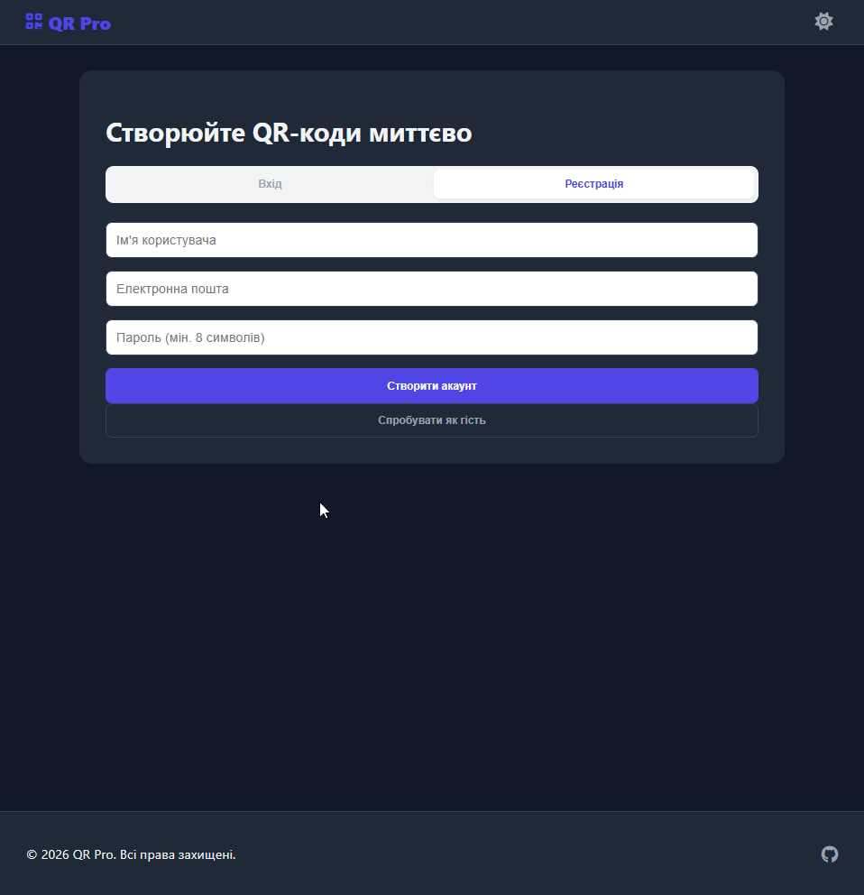
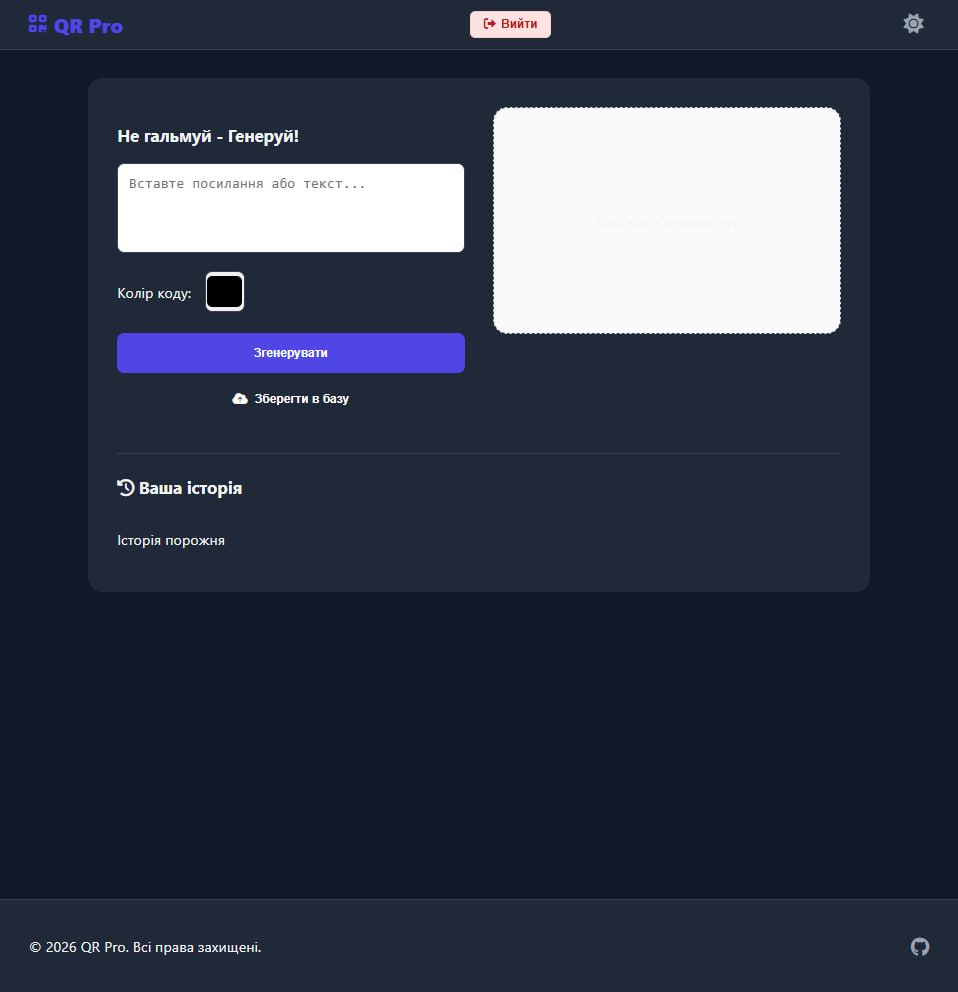

# QR Pro – Генератор QR-кодів 🔳

> Веб-додаток для миттєвого створення, кастомізації та збереження QR-кодів з авторизацією користувачів.




---

## 📌 Про проєкт

**QR Pro** — це курсова робота, що реалізує повноцінний веб-сервіс для генерації QR-кодів. Користувач може зареєструватись, авторизуватись, генерувати QR-коди з кастомним кольором, завантажувати їх у PNG форматі та зберігати в персональну базу даних з історією.

Підтримується також **гостьовий режим** — без реєстрації, з базовим функціоналом генерації.

---

## Функціонал

- **Авторизація** — реєстрація, вхід через JWT-токен, вихід
- **Гостьовий режим** — генерація без реєстрації
- **Кастомізація** — вибір кольору QR-коду через color picker
- **Миттєва генерація** — QR-код з будь-якого тексту або URL
- **Збереження в базу** — зберігання кодів у MySQL для авторизованих користувачів
- **Завантаження PNG** — експорт готового QR-коду
- **Історія** — перегляд усіх раніше збережених QR-кодів
- **Темна/світла тема** — перемикання з збереженням у localStorage

---

## 🛠 Технічний стек

**Frontend:**
- Vanilla HTML / CSS / JavaScript
- SweetAlert2 (toast-повідомлення)
- Font Awesome (іконки)

**Backend:**
- Node.js + Express.js
- JWT (jsonwebtoken) — автентифікація
- bcrypt — хешування паролів
- qrcode — генерація QR-кодів

**База даних:**
- MySQL 8+

---

## 🗄 Структура бази даних

```sql
CREATE DATABASE qr_app;
USE qr_app;

CREATE TABLE users (
  id       INT AUTO_INCREMENT PRIMARY KEY,
  username VARCHAR(100) NOT NULL,
  email    VARCHAR(150) NOT NULL UNIQUE,
  password VARCHAR(255) NOT NULL
);

CREATE TABLE qr_codes (
  id         INT AUTO_INCREMENT PRIMARY KEY,
  user_id    INT NOT NULL,
  qr_text    TEXT NOT NULL,
  qr_image   LONGTEXT NOT NULL,
  created_at TIMESTAMP DEFAULT CURRENT_TIMESTAMP,
  FOREIGN KEY (user_id) REFERENCES users(id) ON DELETE CASCADE
);
```

---

## 📁 Структура проєкту

```
qr-pro/
├── src/
│   ├── server.js       # Express сервер, всі маршрути API
│   ├── db.js           # Підключення до MySQL
├── public/
│   ├── index.html      # Головна сторінка
│   ├── script.js       # Логіка клієнта (auth, QR, UI)
│   └── style.css       # Стилі + темна тема
└── package.json
```

---

## 🚀 Запуск локально

### Вимоги

- Node.js 18+
- MySQL 8+

### 1. Клонування репозиторію

```bash
git clone https://github.com/YOUR_USERNAME/qr-pro.git
cd qr-pro
```

### 2. Встановлення залежностей

```bash
npm install
```

### 3. Налаштування бази даних

Запустіть MySQL та виконайте SQL-скрипт зі структурою БД (див. вище).

У файлі `src/db.js` вкажіть свої дані підключення:

```js
const db = mysql.createConnection({
  host: "localhost",
  user: "root",
  password: "YOUR_PASSWORD",
  database: "qr_app",
});
```

### 4. Запуск сервера

```bash
npm start
```

Додаток буде доступний за адресою: **http://localhost:3000**

---

## 🔌 API Endpoints

| Метод | Маршрут    | Опис                          | Auth |
|-------|------------|-------------------------------|------|
| POST  | /register  | Реєстрація нового користувача | ❌   |
| POST  | /login     | Вхід, отримання JWT-токена    | ❌   |
| POST  | /generate  | Генерація QR-коду             | ❌   |
| POST  | /save-qr   | Збереження QR в БД            | ✅   |
| GET   | /my-qrs    | Отримання історії QR-кодів    | ✅   |

---

## 👤 Автор

ТВ-42 Романченко Нікіта — розробка, дизайн, серверна частина, база даних

[](https://github.com/zxcsf4ik)
